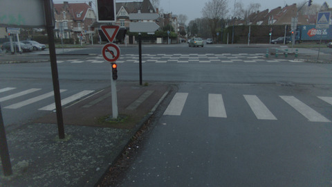
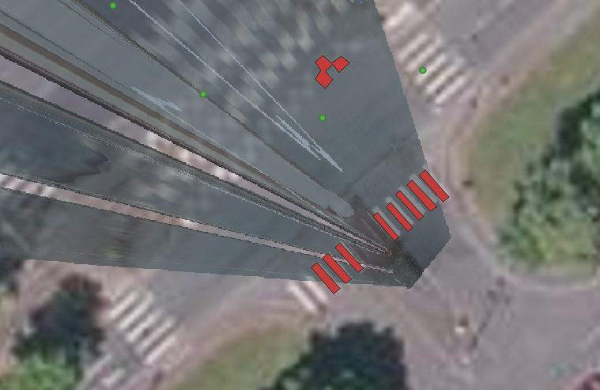
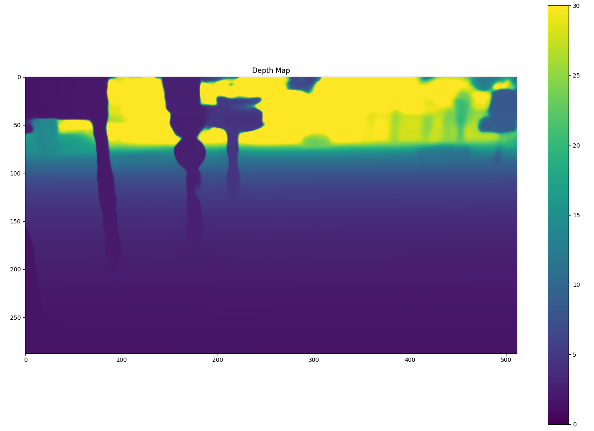
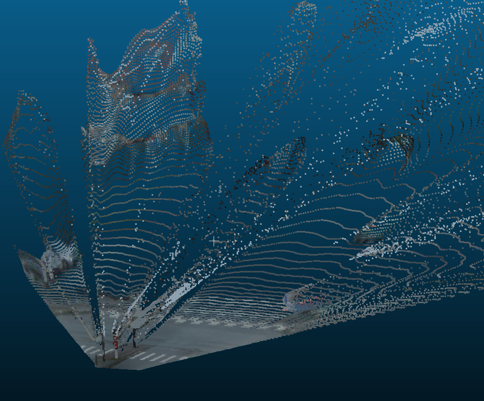

# MAST3R: IGN's fork
This fork is done to test the [MAST3R](https://github.com/naver/mast3r) functionalities for street-level image localization using orthophotos or oriented aerial images as reference.


| Oriented Street-level image | Georeferenced ortho-image  |
|---------|---------|
|  |  |
| *Image & pose (R,T)* | *Ortho-view in QGis* | 

## Installation
```bash
git clone --recursive https://github.com/bsoheilian/mast3r_ign
cd mast3r_ign/docker #only CUDA-based docker is handled for now

#build CUDA docker image
docker_build

#run docker
docker_run
```

## Checkpoint
Download the MAST3R model:
```bash
# to run from host before running docker (docker_run)
mkdir -p checkpoints/
wget https://download.europe.naverlabs.com/ComputerVision/MASt3R/MASt3R_ViTLarge_BaseDecoder_512_catmlpdpt_metric.pth -P checkpoints/
```

## Usage
There are two main functionalities. Both can be run from the docker container. The minimal data to run examples are included in ```mast3r_ign/ign_samples```

### ign_samples directory structure
```
ign_samples/
├── rgb_sample.jpg  #input rgb image
├── R.txt           # Rotation matrix (image2world)
├── T.txt           # 3D coordinates of camera center in world system
└── output/         # outputs will be written here
```

### Depth image inference from a single image
Mast3r inference is used to obtain a depth map from one single image:
```bash
# run the example for depth from single image
cd mast3r_ign
python oriented_image_to_ortho/depth_from_img.py
```
This will provide in ```./ign_samples/output```:
- `rgb_image.npy` - Resampled rgb image (max(H,W) = 512)
- `depth_map.png` - Depth value per pixel (max(H,W) = 512)
- `pose.txt`      - unused projection matrix (ignore it)
- `intrinsic.txt` - intrinsic matrix compatible with rgb_image.npy

<div align="center">
  
  
  *Provided depth map*
</div>

### 3D reconstruction and ortho-image generation
Depth map together with the estimated intrinsic parameters enable to project every pixel to 3D. Extrinsic parameters ```(R,T)``` are used to georeference the 3D points (cf. Fig. below). However the scale of depth is unknown. It can be obtained by measuring a known distance in 3D (width of a zebra-crossing for example). 

<div align="center">
  
  
  *Georeferences 3D points*
</div>

The PyTorch3D functionalities are used to generate an ortho-view on GPUs. 

The following command shows an example of how to generate an ortho-image from color images, a depth map, and extrinsic parameters:

```bash
cd mast3r_ign
python oriented_image_to_ortho/ortho_from_dept_and_ori.py
```
This will provide in ```./ign_samples/output```:
- `ortho.png` - colored ortho-image
- `ortho.vrt` - Georeferencing file

<div align="center">
  
  
  *Georeferenced ortho image of 5 cm GSD overlaid on aerial-based ortho-image in QGIS*
</div>

### Full pipeline from street-level image to ortho-image
The full pipeline can be run using the following command: 
```bash
cd mast3r_ign
# to run an example using the included data in the package
python run_ori_img_to_ortho.py --z_scale 2.5 --trans ./ign_samples/T.txt --rot ./ign_samples/R.txt
#to run on other examples use help
python run_ori_img_to_ortho.py --help
```
This pipeline creates a georeferenced ortho from: 
- rgb image
- rotation and translation in RGF93 system.
- GSD 
- z_scale to be estimated manually 

## Conclusions and perspectives
The provided pipeline anable to generate ortho-views from street-level images. There are multiple possible usages:

### Refine the image georeferencing 
If initial georeferencing parameters are known ```(R,T)``` the actual tools enable to compare the resulting ortho agains the reference ortho-images in RGE. The problem to solve is an image alignement for which: 
- ```(R,T)``` are to be refined
- Scale factor is to be resolved

### Generate reference data for learning new model adapted to aligning aerial-street level images 
Once the georeferencing of existing data is refined they can be used as reference data to learn another model like that of [AerialMegaDepth](https://github.com/kvuong2711/aerial-megadepth) to adapt the same structure/architecture of model to our problem namely: street-level image georeferencing. 

### Use refinement approach for georeferencing by relaxing the unknowns ```(R,T)```


 


